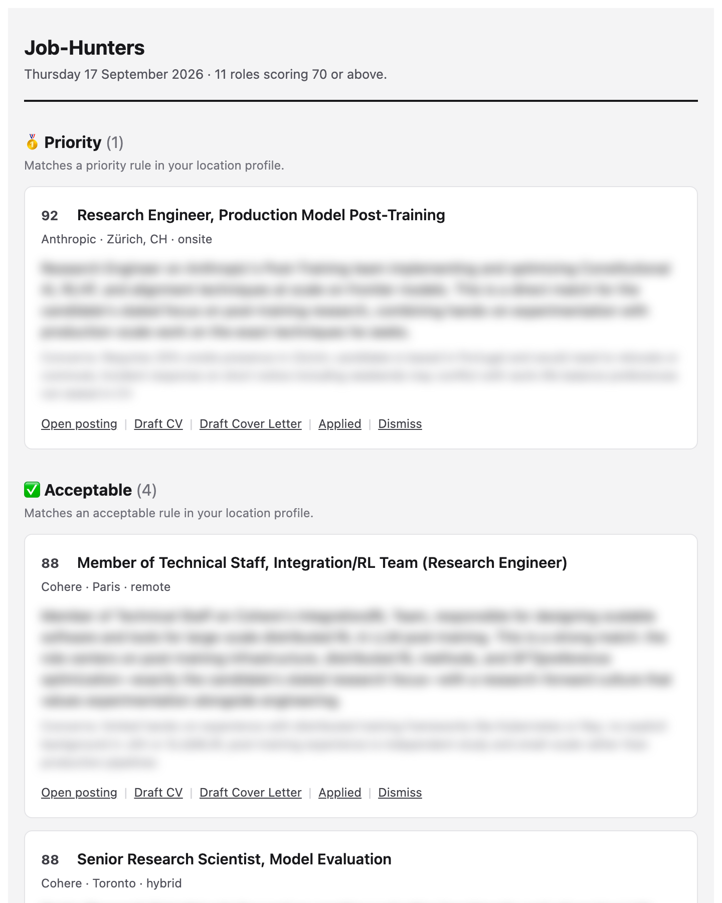
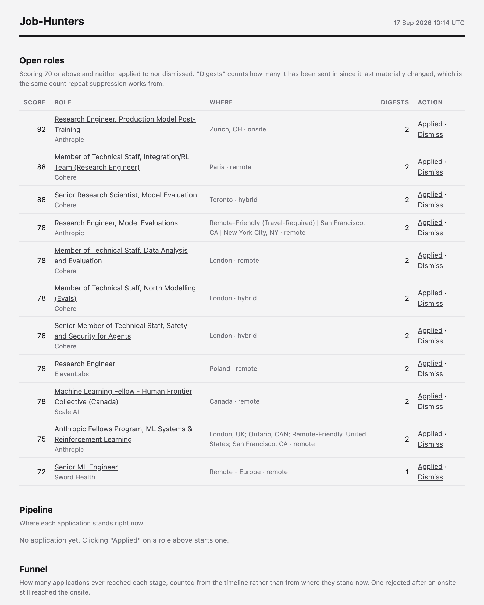

# Job-Hunters

A self-hosted pipeline that watches company job boards, judges every new posting against a written description of the job you want and emails you one short digest a day with only the roles worth reading. Each entry in the email carries signed links to record what you did about it and a small dashboard tracks the applications that follow.

<table align="center">
  <tr>
    <td align="center" width="50%"></td>
    <td align="center" width="50%"></td>
  </tr>
  <tr>
    <td align="center"><em>Email Digest</em></td>
    <td align="center"><em>Applications Dashboard</em></td>
  </tr>
</table>

This project was built with the goal of making job searching more efficient. Everything that is specific to the search lives in three YAML files, so another person can adopt it by editing the configuration rather than the code. The current configuration is set for AI research roles in LLM post-training and evaluation.

It is **single-user and runs on your own machine**: there is no login, no hosting and no support for more than one profile. And it **never acts on your behalf**: nothing is submitted to a company and the only email it sends is the digest to you.

The pipeline that runs today is deterministic code with two LLM calls (a judge that scores postings and an extractor that reads company names out of prose). In the future, a tailoring agent that drafts tailored CVs and cover letters will be added to the pipeline - see [Future Work](#future-work).

## Contents

- [Methodology](#methodology)
- [Project structure](#project-structure)
- [Configuration](#configuration)
- [Environment and setup](#environment-and-setup)
- [Data and confidentiality](#data-and-confidentiality)
- [Testing and evaluation](#testing-and-evaluation)
- [Future work](#future-work)

## Methodology

The system is two loops around one database. The first loop is daily. Every two hours the ingest job fetches the boards of the companies on your watchlist, cleans and merges what it finds so that one opening listed twice counts once, and scores each new job in two steps: 

1. A free prefilter on title, keywords and location drops the plainly wrong jobs.
2. A paid LLM call reads the surviving jobs against your CV and a written rubric and returns a score from 0 to 100.

Each morning the digest job emails the jobs whose best score clears a threshold, filed by how well the location fits, each with links to record what you did about it. Clicking one opens a confirmation page on the local web service and from there the tracker keeps the application's timeline and the dashboard counts what happened.

The second loop is weekly and feeds the first. The discover job reads places where companies announce that they are hiring, pulls the company names out, looks for their job boards and queues the ones it finds for you to approve or reject. An approved company joins the watchlist and its postings arrive with the next fetch. Nothing joins the watchlist without you asking for it.

```
  ┌────────────────────────┐      ┌────────────────────┐       ┌─────────────────────┐
  │  INGEST  (every 2h)    │      │  DIGEST  (08:00)   │       │  ACTIONS (you)      │
  │  fetch every watched   │      │  best score per    │       │  Applied / Dismiss  │
  │  board, deduplicate,   │─────▶│  open job above    │──────▶│  via signed links,  │
  │  then SCORE what is    │  DB  │  threshold, split  │ email │  then the tracker   │
  │  new: prefilter, judge │      │  by location fit   │       │  and the dashboard  │
  └───────────▲────────────┘      └────────────────────┘       └─────────────────────┘
              │ watchlist
  ┌───────────┴────────────┐       ┌────────────────────┐
  │  PROMOTE  (you)        │       │  DISCOVER (weekly) │
  │  review the queue,     │◀──────│  read HN and three │
  │  approve or reject     │ queue │  aggregators, name │
  │                        │       │  the companies and │
  │                        │       │  probe their boards│
  └────────────────────────┘       └────────────────────┘
```

Everything is stored in one SQLite database. A scheduler container runs the timed stages, a web container serves the dashboard (`http://localhost:8000`) and the action links. Every stage in the pipeline can also be manually run with a command - see [Command Reference](#command-reference).

### 1. Ingest

The `config/companies_watchlist.yaml` file names the companies to watch and which applicant-tracking system (ATS) hosts each company board and under which token. Three ATSs are supported through their public JSON endpoints: **Greenhouse**, **Lever** and **Ashby**. Every two hours the ingest job fetches every active board and reconciles what it finds:

- Each posting is upserted into the `job_sources` table, keyed on the board and the board's own id, so that a repeat fetch updates the `last_seen` column instead of inserting again.
- A posting that a board listed last time and not this time is marked closed — but only when the fetch succeeded *and* returned at least one posting. A board that times out, or comes back empty, closes nothing, so that a transient failure can never make every job at a company disappear.
- Each company is its own transaction. One board failing, or one bug in one adapter, never rolls back or aborts the others.

The `job-hunters probe <company>` command finds which ATS and token host a company's board by trying a handful of name spellings against all three URL patterns and printing a ready-to-paste watchlist line.

### 2. Normalize and Deduplicate

Boards describe the same opening in different ways, so postings are cleaned before they are compared. HTML is turned into text. Free-text locations are parsed into a country token and a work mode (`onsite`, `hybrid` or `remote`) using small explicit lookup tables. When the location parser is unsure it says `unknown` rather than guessing. Titles are stripped of the noise (requisition ids, punctuation, case or "(Remote)" suffixes).

Deduplication then decides which postings are the same real-world opening. First a canonical key, `sha256(company | normalized title | region)`, and when that finds nothing, a fuzzy pass comparing normalized titles within the same company and region to catch reordering ("Post-Training Research Scientist" vs "Research Scientist, Post-Training"). Postings that resolve to the same opening share one row in the `jobs` table. The rule is deliberately strict: a missed merge shows a near-duplicate twice, while a false merge hides a real job - the former is a cheaper mistake.

### 3. Score

Scoring runs as the second half of every ingest and it has two stages. Both are biased toward recall: each would rather waste a cheap step than drop a posting that could be worth seeing.

**The prefilter is free.** Only open postings not yet judged under the current `prompt_version` in the `search_profile.yaml` are considered. A job whose title contains an excluded term, or whose location is not accepted by any rule in the profile, is dropped. Of the rest, a posting is kept if its title matches an included term *or* its description contains a domain keyword. This is deliberately noisy: letting junk through costs a fraction of a cent for the judge to reject, while a missed role is a job you never knew existed.

**The judge is a model call.** Survivors are grouped by identical text and each group is one call to `claude-haiku-4-5`, ordered oldest first and up to a per-run cap - anything beyond the cap carries over untouched. The model choice for the judge and the per-run cap parameters are configurable in `system_config.yaml`. The system prompt is assembled once per run from your CV (every markdown file in `profile/`), as well as from the rubric, score bands, worked examples, declared location and work-authorization facts in `search_profile.yaml`. The prompt is marked for prompt caching so every call after the first reads it at a fraction of the cost. The answer is a structured `Verdict`: a score from 0 to 100, a two-sentence summary for the digest, a rationale, what matched, what argues against and a `work_authorization` finding.

The final score belongs to a posting and not to a job, since two postings on one board can share a title and a city *and* still be different roles. A job's score is the best among its currently open postings and computed on demand so that it cannot go stale when a posting closes.

### 4. Digest

The digest is a template over a SQL query with no model call anywhere in it. Everything it shows was decided earlier. Every morning it takes each job's best open score, drops anything below the threshold and anything already acted on, and files each survivor into a section by location fit:

| Section | What lands in it |
|---|---|
| 🥇 Priority | Matches a priority rule in your location profile. |
| ✅ Acceptable | Matches an acceptable rule. |
| ⚠️ Worth Checking | The location could not be parsed or the judge found the work-authorization status unclear or blocked (each entry says which). |

A job entry in each section shows the score, title, company, location, work mode, the judge's summary and concerns, a link to the posting and four signed action links - see [Actions and Tracking](#5-actions-and-tracking). Below the job sections the email reports the promotion loop: which companies joined the watchlist this week and how many discovered companies are waiting for a decision.

**Repeat suppression** stops a job you neither applied to nor dismissed from filling the email forever. After three appearances it is demoted to the bottom of its section and after five it is folded into a one-line "Still Open (N)" link to the dashboard. A score that moves by more than ten points resets the counter and a job comes back if its posting changes. These parameters are configurable in `system_config.yaml`.

The email is sent as both HTML and plain text. It is also sent even when nothing cleared the threshold: a quiet morning and a broken pipeline look identical from an empty inbox.

### 5. Actions and Tracking

Each entry carries four links that point at the local web service: **Draft CV**, **Draft Cover Letter**, **Applied** and **Dismiss**. A link is a token signed with HMAC-SHA256 under a secret from `.env`, naming one action on one job and expiring after a configurable number of days (long by default, because a digest can sit in an inbox for weeks). Clicking one opens a confirmation page and nothing changes until you press the button. Every action is idempotent: a link opened twice, forwarded, or found again months later, decides from the state it finds, instead of from what the link says. Therefore, clicking "Applied" on a job already applied to says so rather than writing a second row to the `applications` table.

*Note:* The two drafting links (Draft CV and Draft Cover Letter) are in place but answer with a notice until the tailoring agent exists - see [Future Work](#future-work).

The dashboard at `http://localhost:8000` shows the open roles above threshold, the pipeline of applications by status, the funnel (how many ever reached each stage) and response rates.

### 6. Discover and Promote

The watchlist only finds jobs at companies you already declared in `companies_watchlist.yaml`. Once a week the discover job reads sources where companies announce that they are hiring, such as the **Hacker News** "Who is hiring?" thread and the **RemoteOK**, **Arbeitnow** and **Remotive** aggregators, and turns them into a queue of companies to consider:

1. Every posting is prefiltered with the title terms and strong keywords from the profile, but without the location rules.
2. Each kept posting is stored as a sighting so it is never processed twice.
3. The sighting is attached to a candidate company. A company already on the watchlist is skipped, an existing candidate is merged by name or by board, and a new one is probed against the three ATS patterns to find its board.

Sightings never become jobs and never reach the digest. The `job-hunters promote --review` command lists the queue and `--approve` appends the company to `companies_watchlist.yaml`, while `--reject` silences it. Nothing is ever added to the watchlist without a person asking for it. Once a company is approved and added to the watchlist, its job postings arrive with the next ingest.

### 7. Schedule and Backups

The scheduler registers four jobs on the schedules in `system_config.yaml`, interpreted in the configured timezone:

| Job | Default | What it does |
|---|---|---|
| `ingest` | `every 2h` | Fetch every watched board, then score what turned up |
| `digest` | `daily 08:00` | Build and send the email |
| `discover` | `weekly mon 06:00` | Read the discover sources and queue new companies |
| `backup` | `weekly sun 02:00` | Copy the database into `backups/` |

Each job has a misfire grace, so a machine that was asleep at the scheduled time runs the job late instead of skipping it. A failure inside a job is logged and never brings the scheduler down. The scheduler is a separate process from the web service on purpose: if it ran inside the web server and the worker count were ever raised, every worker would start its own copy.

A backup is a consistent copy taken through SQLite's online backup API while the database is in use. The oldest copies beyond a configured number in `system_config.yaml` are removed only after the new one passes the integrity checks.

## Project Structure

```
Job-Hunters/
├── config/
│   ├── search_profile.yaml        what you are looking for: titles, keywords, locations, rubric
│   ├── system_config.yaml         how the system runs: schedules, models, email server, backups
│   └── companies_watchlist.yaml   which companies to watch
├── profile/                       (untracked) your CV as markdown (read by the judge)
├── data/                          (untracked) the SQLite database for commands run on the host
├── backups/                       (untracked) timestamped database copies
├── src/job_hunters/
│   ├── cli.py                     the `job-hunters` command and its subcommands
│   ├── config.py                  pydantic models and loaders for the three YAML files
│   ├── paths.py                   every filesystem location, overridable by environment variable
│   ├── tables.py                  SQLAlchemy definitions of the nine tables
│   ├── db.py                      engine, SQLite pragmas, sessions and schema check
│   ├── sources/                   one adapter per board type
│   │   ├── base.py                RawPosting, FetchResult and the adapter interface
│   │   ├── greenhouse.py          ATS board (ingest)
│   │   ├── lever.py               ATS board (ingest)
│   │   ├── ashby.py               ATS board (ingest)
│   │   ├── hn.py                  aggregator (discover)
│   │   ├── remoteok.py            aggregator (discover)
│   │   ├── arbeitnow.py           aggregator (discover)
│   │   └── remotive.py            aggregator (discover)
│   ├── ingest.py                  fetch, upsert, close, per-company transactions
│   ├── normalize.py               HTML to text, location parsing, title normalization
│   ├── regions.py                 the country and region vocabulary
│   ├── dedup.py                   canonical key, fuzzy match, merge policy
│   ├── scoring.py                 the prefilter, batching and the best-score rule
│   ├── judge.py                   the model call, system prompt and Verdict schema
│   ├── evaluate.py                precision and recall against hand-labeled postings
│   ├── digest.py                  sections, repeat suppression, the email's contents
│   ├── mailer.py                  SMTP delivery
│   ├── actions.py                 signing and verifying action links
│   ├── tracker.py                 what an action does and what the dashboard counts
│   ├── web.py                     FastAPI routes: health, dashboard, action pages
│   ├── templating.py, templates/  the Jinja environment, the email and the pages
│   ├── probe.py                   finding a company's board across the three ATSs
│   ├── extract.py                 the model call that reads a company out of prose
│   ├── discover.py                the weekly run that fills the review queue
│   ├── promote.py                 reviewing the queue and editing the watchlist
│   ├── scheduler.py               the four timed jobs
│   ├── backup.py                  consistent copies and retention
│   └── gitcheck.py                the pre-commit check that private paths are not tracked
├── tests/                         pytest suite and recorded fixtures (runs offline)
├── .githooks/pre-commit           runs `job-hunters check-git` before every commit
├── setup.sh                       one-time setup after cloning
├── Dockerfile, docker-compose.yml the `web` and `scheduler` services
├── .env.example                   the secrets and addresses to fill in
└── pyproject.toml, uv.lock        dependencies, pinned
```

## Configuration

The three YAML files under `config/` describe the job search and are validated at startup against a schema that forbids unknown keys, so a typo is an error rather than a setting that never took effect. They need to be rewritten to use this system for a different search. Nothing in them is a secret. The `job-hunters show-config` command loads all three files and prints a summary.

| File | What it holds |
|---|---|
| `search_profile.yaml` | Titles to include and exclude, strong and supporting keywords, seniority, where you are based, which locations and work modes count as priority or acceptable, where you can work without sponsorship, the score threshold, and the rubric, score bands, guidance and worked examples pasted into the judge's prompt. |
| `system_config.yaml` | Timezone, the base URL that links are built from, link lifetime, the four schedules and their misfire grace, which model each stage uses, the discover sources and caps, the SMTP server, repeat-suppression settings, backup retention. |
| `companies_watchlist.yaml` | One line per company with slug, display name, ATS, token and a tier label. |

Nothing in `config/` is secret and all three files are tracked in git. Secrets and anything that identifies you go in `.env` and your CV goes in `profile/` as markdown. Neither are tracked by git - see [What stays private](#what-stays-private).

Note that bumping `scoring.prompt_version` in `search_profile.yaml` invalidates every prior score, which is what you want after changing the rubric. This way, the next ingest re-judges everything open, within the per-run cap, carrying the rest over.

## Environment and Setup

### Requirements

- [uv](https://docs.astral.sh/uv/getting-started/installation/) — installs Python 3.12 and every dependency.
- Docker Desktop for the scheduled pipeline. Every command also runs directly on the host without it.
- An Anthropic API key for the judge and the extractor.
- An SMTP account to send the digest from. For Gmail this means an App Password and not the account password.

### First-time Setup

```sh
git clone https://github.com/nelsonfilipecosta/Job-Hunters.git
cd Job-Hunters
./setup.sh
```

The script installs dependencies with `uv sync`, creates `profile/`, points git at the tracked pre-commit hook, creates the host database schema and, if the Docker daemon is reachable, builds the images. It is safe to re-run.

Three steps remain manual:

1. Edit the `config/search_profile.yaml`, `config/system_config.yaml` and `config/companies_watchlist.yaml` configuration files based on your job search.
2. Crete the `.env` by running the command `cp .env.example .env` and fill it in with the API key, a random `ACTION_TOKEN_SECRET` (the file says how to generate one), the email address the digest goes to and the SMTP credentials it is sent with.
3. Add your CV to `profile/cv.md` as a markdown file. Every markdown file in `profile/` is joined into the judge's prompt, so keep only what the judge should read.

If unsure of how to fill a company's parameters in `config/companies_watchlist.yaml`, you can use `job-hunters probe <company>` to find the company's board and add it.

Then check it all loads:

```sh
uv run job-hunters show-config
```

### Running by Hand

```sh
uv run job-hunters ingest                           # fill the database from every watched board
uv run job-hunters score --dry-run                  # what the prefilter would send to the judge (free)
uv run job-hunters score --limit 20 --verbose       # the first paid run (printing each verdict)
uv run job-hunters digest --dry-run > digest.html   # preview the email, but send nothing
uv run job-hunters digest                           # send the email
uv run job-hunters discover --dry-run               # what the discover sources would queue (free)
uv run job-hunters promote --review                 # companies waiting for a decision
```

Commands run this way use the host database in `data/`. The containers use their own database in a Docker volume (SQLite's file locking is not reliable across the macOS bind-mount layer). To act on the live database run the same commands inside a container: `docker compose exec scheduler job-hunters <command>`.

### Running with Docker

```sh
docker compose up -d                # start web and scheduler
docker compose logs -f scheduler    # follow what the scheduled jobs are doing
docker compose down                 # stop web and scheduler (the database volume survives)
```

Two services share one image and one database volume. `web` serves the dashboard and the action links on `http://localhost:8000`, bound to the loopback interface only. `scheduler` runs the four timed jobs. `src/`, `config/` and `profile/` are bind-mounted, so editing code restarts the services and editing configuration takes effect on the next run, with no rebuild. Rebuild (`docker compose build`) only when dependencies change. `.env` is injected at run time and never baked into the image.

### Command Reference

| Command | What it does |
|---|---|
| `show-config` | Validate and summarise the three config files |
| `check-git` | Refuse if `profile/`, `data/`, `backups/` or any `.env*` file is tracked by git |
| `init-db` | Create the data directories and the database schema |
| `ingest [--only SLUG]` | Fetch every watched board, or only the named companies |
| `probe <company>` | Find which ATS and token host a company's board |
| `score [--limit N] [--dry-run] [--verbose]` | Judge unscored postings: prefilter, then the model |
| `evaluate [--skip-llm] [--labels PATH]` | Measure the scorer against hand-labeled postings |
| `digest [--dry-run]` | Build the email and send it, or print the HTML instead |
| `backup` | Write a timestamped copy of the database to `backups/` |
| `discover [--only SOURCE] [--dry-run]` | Read the discover sources and queue new companies |
| `promote [--review] [--approve ID] [--reject ID] [--slug] [--name] [--tier]` | Review the queue; append or silence a company |

## Data and Confidentiality

### Where data lives

Everything is in one SQLite file (`job_hunters.db`) opened in WAL mode with foreign keys on and a busy timeout so the web and scheduler processes can share it. On the host it is `data/job_hunters.db`. In Docker it is the named volume `job-hunters-data`, which survives `docker compose down` and is destroyed by `docker compose down -v`. The schema is created by `init-db` and checked at startup - there are no migrations yet, so a schema change means recreating the file.

| Table | One row per |
|---|---|
| `companies` | Organization whose board is polled, mirrored from the watchlist |
| `job_sources` | Posting as a board returned it, with the raw payload |
| `jobs` | Real opening after deduplication |
| `scores` | Judgement of one posting under one prompt version |
| `applications` | Job you applied to or dismissed, with its current status |
| `application_events` | Dated event behind an application (applied, interview, offer, …) |
| `digest_appearances` | Job included in one digest email |
| `fetch_runs` | Attempt to fetch a board, with its outcome |
| `candidate_companies` | Company the discover sources saw hiring |

Backups go to `backups/`, which is bind-mounted into the containers so they exist outside Docker. Both the weekly job and the `job-hunters backup` command keep the eight most recent backups by default.

### What stays private

This repository is public and the files and folders below are never committed.

| Path | What it holds |
|---|---|
| `.env` | The API key, the signing secret, the SMTP password and your email addresses |
| `profile/` | Your CV and any other record about you |
| `data/` | The host database with every posting, score and application |
| `backups/` | Timestamped copies of the Docker database |

Three layers enforce that these files and folders stay private:

- `.gitignore` lists them.
- `.githooks/pre-commit` runs `job-hunters check-git` before every commit and aborts if any of them is tracked (`setup.sh` enables the hook and `.git/hooks/` is not cloned, so a tracked hook directory is the only way it travels with the repository).
- `.dockerignore` keeps the same paths out of the image, so secrets reach the containers only through `env_file` at run time.

### What leaves the machine

The system calls an LLM through the API in two places and each sends a different text:

- **Score.** Once per group of identical postings that passed the prefilter, the judge sends the posting itself with company, title, location and description. Ahead of it, as a prefix shared by every call in the run, your CV (every markdown file in `profile/`) and the rubric, score bands, worked examples, location and work-authorization facts from `search_profile.yaml`.
- **Discover.** Once per sighting that does not name its company, which in practice is a Hacker News comment, the extractor sends the text of that comment cut at a fixed length. Nothing from `profile/` or `search_profile.yaml` goes with it.

Requests to job boards carry a `User-Agent` naming this project. The digest goes to the address in `.env` through the SMTP server in `system_config.yaml`. Nothing else is sent anywhere and nothing is ever sent to a company.

### The action links

The web service is bound to `127.0.0.1`, so the links in the digest only work from the machine running this system. Each link is signed, expires and does nothing until confirmed on the page it opens. That signed token is what makes a forged or replayed request harmless and it is the reason the service has no login and no CSRF token — a design that holds only while it stays loopback-bound and single-user. Templates render with autoescaping on, so that a posting's text cannot inject markup into the email or the pages.

## Testing and Evaluation

The test suite runs in a few seconds and needs neither an API key nor a network connection.

```sh
uv run pytest
```

Board adapters take an HTTP client so tests inject recorded payloads (`tests/fixtures/boards/` and `tests/fixtures/discover/`) instead of touching the network, the judge is stubbed and every test builds its own temporary database. It covers configuration validation, every adapter, normalization against a fixture of real location strings, deduplication and merging, the prefilter, digest sections and repeat suppression, link signing, the idempotent actions, the dashboard, the discover loop, the scheduler and the backup retention.

The judge itself is measured separately. The `tests/fixtures/labeled_jobs.yaml` file holds real postings labeled as relevant or not. The `job-hunters evaluate` command runs the same prefilter and judge over these postings and reports precision, recall and F1 at the configured threshold, plus how many relevant postings the prefilter would have dropped before the judge saw them. `--skip-llm` reports the prefilter alone for free. Run it after changing the rubric, the bands or the examples.

## Future Work

Development is currently paused while the system runs on its schedule. The pieces below are planned but not built.

- **The tailoring agent.** The Draft CV and Draft Cover Letter links already sit in every digest entry and currently answer with a notice. Behind them will be a tailoring agent: a stable prompt prefix built from the CV and discrete achievement records in `profile/`, cached across calls; retrieval over the thesis and papers (kept as PDFs, extracted to text, chunked and embedded) for the technically specific jobs; and generation with `claude-opus-5` where every claim in the draft cites the profile record it came from, so a draft can be checked against the truth before it is sent. Drafting runs as a background task and reports back by email rather than blocking the click.

- **The follow-up nudger.** `system_config.yaml` already declares `followup_after_days`. A daily check will find applications older than that with no subsequent event and add a "Follow up?" section to the digest.

- **Workday.** NVIDIA, IBM, Intel, Adobe, Salesforce and Qualcomm run their boards on Workday, which has no public registry of tenants and needs a second request per posting for the description. The plan is a single-tenant adapter taking the tenant and site as explicit configuration on the watchlist line, added one company at a time, rather than general Workday support.

- **Companies with proprietary systems.** Google, Microsoft, Amazon, Apple and Meta run their own job systems, which are neither Workday nor any supported ATS. Reaching each one is a bespoke adapter. A number of smaller AI companies have no board on any supported ATS either. These are reachable only through the discover sources or by checking by hand.

Not planned: LinkedIn (its terms forbid the scraping and its public endpoints carry no descriptions) and a hosted multi-user version, which would be a different project with authentication, per-user secrets and data-protection obligations over stored CVs.
